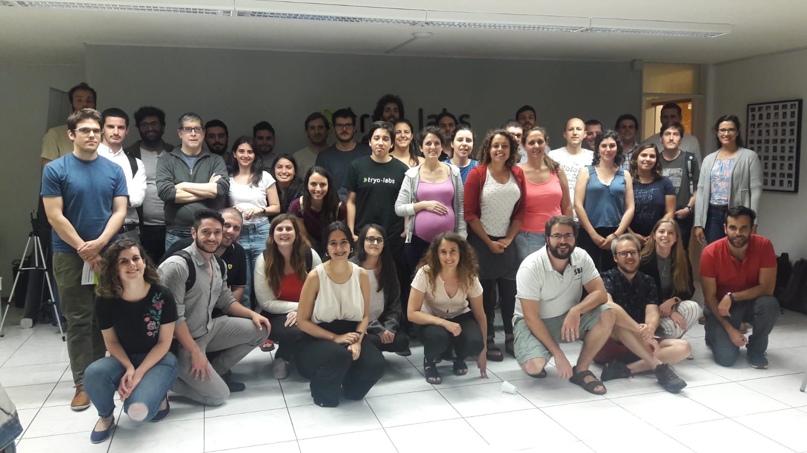
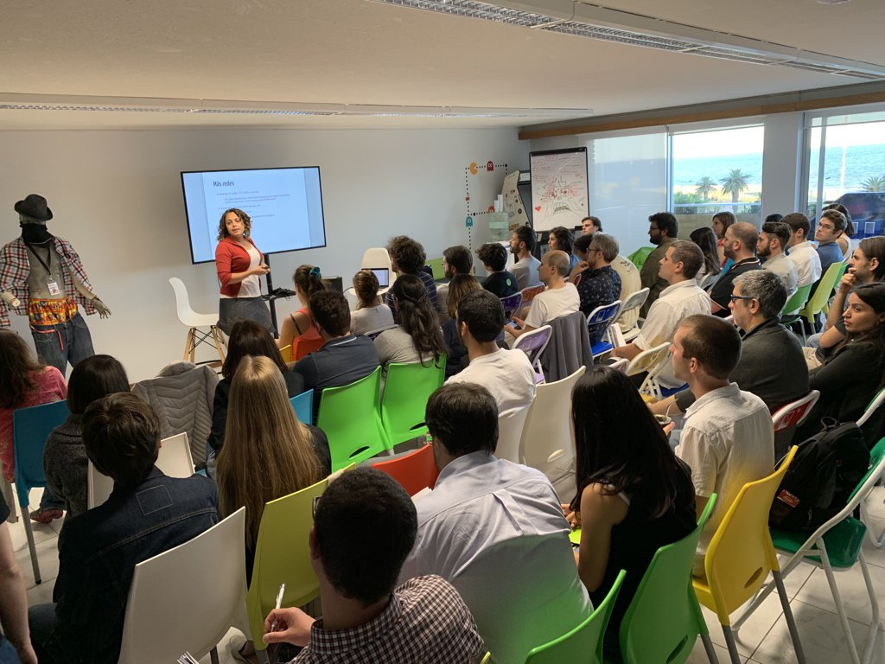
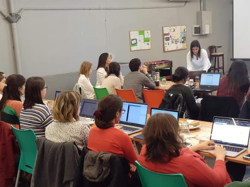

```{r setup, include=FALSE}
options(htmltools.dir.version = FALSE)
knitr::opts_chunk$set(warning = FALSE, message = FALSE)
```

layout: true

background-image: url(images/Rlogo.svg)
background-position: 1% 99%
background-size: 7%

---

# Presentación GURU-mvd

<br>

[GURU-mvd](https://www.meetup.com/es-ES/GURU-mvd/) | [@gurumvd](https://twitter.com/gurumvd) | [github](https://github.com/GURU-MVD/meetup_presentations)

- Espacio de encuentro e intercambio entre usuari@s e interesad@s en el **lenguaje de programación R**.
- Nos motiva ayudarnos, compartir experiencias y desafíos.
- Desarrollamos la comunidad R en Montevideo.
- Nos nucleamos a través de meetup y ya somos como 262 personas `r emo::ji("nail")`

-- 

Sobre **R**:

- Es software libre con licencia *GNU GPL* `r emo::ji("biceps")`
- Es un lenguaje de programación especializado en análisis estadístico y gráficas (pero ahora se puede hacer de todo `r emo::ji("wow")`)
- Muy utilizado para ciencia de datos. 
- Es el estandar de la comunidad estadística.

---

# Grupo

- Formaciones muy diversas:
  - Sociólog@s / Biólog@s / Estadístic@s / Matemátic@s / Politólog@s / Ingenier@s en Computación / Economistas
- Paridad de género `r emo::ji("woman")` `r emo::ji("man")`
- [R-Consortium](https://www.r-consortium.org/) brinda soporte a GURU::mvd (y todos los grupos de usuari@s a nivel global)

.pull-left[]
.pull-right[]

---

# R-Ladies Montevideo

[rladies-montevideo](https://www.meetup.com/es-ES/rladies-montevideo/) | [@RLadiesMVD](https://twitter.com/RLadiesMVD) | [github](https://github.com/rladies/meetup-presentations_montevideo)

- Organización mundial que promueve la diversidad de género en la comunidad R.
- Primer iniciativa de comunidad de R en Montevideo.

.center[]

---
# Lo que se viene

### Charlas y talleres usando datos abiertos `r emo::ji("hooray")`

- (escuchamos propuestas)

### Organización del LatinR 2020 en Montevideo `r emo::ji("uruguay")`

[latin-r.com](http://latin-r.com) | [@LatinR_Conf](https://twitter.com/LatinR_Conf)

- Conferencia Latinoamericana sobre Uso de R en Investigación + Desarrollo.

---

layout: false

# Fin

```{r}

terminamos <- TRUE

if (terminamos) {

  print("Muchas gracias!")  
  
}

```

- A [Datos y Cogollos](https://www.meetup.com/es-ES/Cafes-de-DATA/events/264458512/) por la iniciativa de dar a conocer lo que se está haciendo con datos abiertos.

.footnote[El repositorio de código de esta presentación está en el GitHub de GURU: [github.com/GURU-MVD](https://github.com/GURU-MVD/meetup_presentations) <br> Realizada con **R** y `r emo::ji("heart")`]
