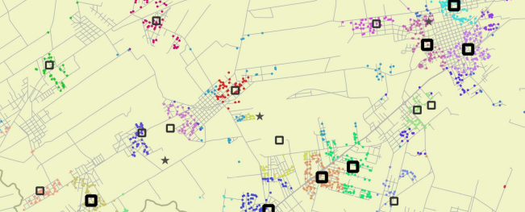
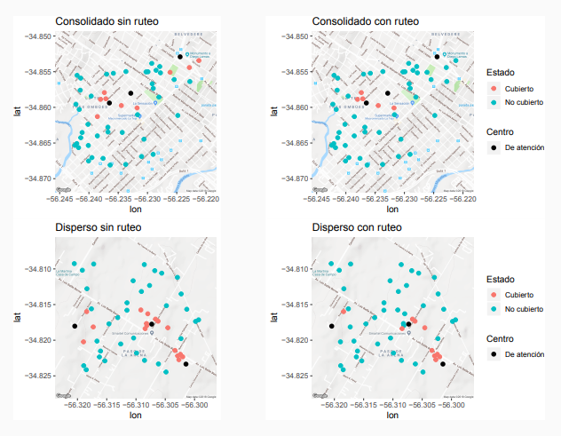
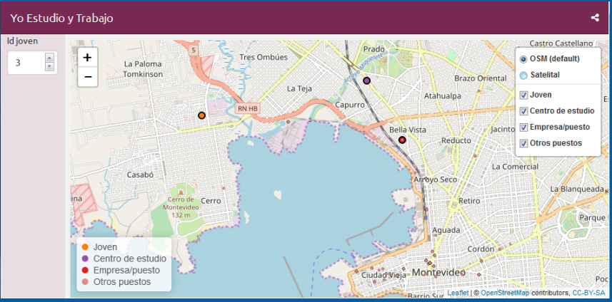

---
# Formación - deformación

- Formado como Antropólogo y pichón de Demógrafo 
  
--

- Devenido a pseudo-geógrafo y amante de la programación en R
  
--

- Afortunadamente puedo combinar mi cargo de Antropólogo en el Dpto. de Geografía del MIDES con mi gusto por R.
  

<!-- \hyperlink{label}{\beamerbutton{I jump to fourth slide of next frame}} -->

---
# SIG o GDS?

Diferencias principales entre el campo de los Sistemas de Información Geográficos (**SIG**) y el de la _Geographic Data Science_ (**GDS**):

| Atributos      | SIG       | GDS    |
|----------------|---------------|----------------|
| Disciplinas   | Geografía  | Geografía, Computación, Estadística |
| Foco | Interfaz Gráfica  | Código |
| Reproducible  | Mínimo   | Máximo |

<!-- Esta distinción es importante por ejemplo en el contexto de tener un impacto en las políticas: al ser abierto y transparente (y por lo tanto usar código en lugar de una interfaz gráfica de usuario no reproducible) la investigación maximiza sus posibilidades de alterar las decisiones. -->

---
# Analisis de puntos

<!-- \hypertarget<4>{label}{\beamerbutton{I'm on the fourth slide}} -->

Los Modelos Espaciales Puntuales:

- inicialmente implementados por botánicos y ecólogos, en la década de los 30 del siglo XX.
  
--

- En la actualidad este tipo de análisis es empleado en muchos campos tales como la arqueología, la epidemiologia, marketing o la criminología.   
--

- Por ejemplo, es posible estudiar qué distribución espacial presentan los casos de una enfermedad determinada.
  

---
# Caso [**CAIF-ANEP**](http://dinem.mides.gub.uy/innovaportal/file/61671/1/estudio-de-localizacion-optima-para-cobertura-de-primera-infancia.-2015.pdf)

<!-- { width=10% } &nbsp; { width=10% } -->

 

---
# Distancias

- Hay varios tipos de distancias... 
  
--

- `r icon::fa("external-link-alt", size=1)` __euclidianas VS redes__ `r icon::fa("route", size=1)` 
  
--

- [EPP incorporó redes...](http://47jaiio.sadio.org.ar/sites/default/files/LatinR_10.pdf)
  

 

---
# Caso [**"Yo Estudio y Trabajo"**](http://dinem.mides.gub.uy/innovaportal/file/104414/1/yet_dinem_ipgh.pdf)

---
# Para profundizar

.left-column[

`r icon::fa("meetup", size=3, color="#de2d26")`   

`r icon::fa("globe-americas", size=3, color="#756bb1")`   

`r icon::fa("telegram", size=3, color="#2c7fb8")`   

`r icon::fa("github", size=3)` 

]

.rigth-column[

 
Comunidad en Uruguay: [meetup R-Ladies](https://www.meetup.com/es-ES/rladies-montevideo/) y [meetup GURU](https://www.meetup.com/es-ES/GURU-mvd/)
  
  

[Web R espacial ES](http://respaciales.ourproject.org/index.php?title=P%C3%A1gina_principal)
  
  

Grupos de Telegram: [R espacial ES](https://t.me/rspatial_es) y [GURU](https://t.me/GURU)
  
  

[Taller R espacial](https://gitlab.com/RichDeto/Talleres_R_GvSIG/tree/master/presentacion_R_espacial)

]

---

  
  
  
  
